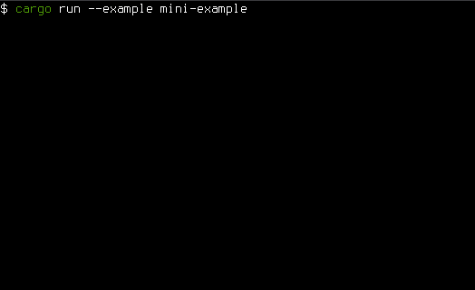

# Interact &emsp; [![Build Status]][travis] [![Latest Version]][crates.io] [![Docs badge]][Docs link] [![License badge]][License link]

[Build Status]: https://api.travis-ci.org/interact-rs/interact.svg?branch=master
[travis]: https://travis-ci.org/interact-rs/interact
[Latest Version]: https://img.shields.io/crates/v/interact.svg
[crates.io]: https://crates.io/crates/interact
[License badge]: https://img.shields.io/badge/license-MIT%2FApache--2.0-blue.svg
[License link]: https://travis-ci.org/interact-rs/interact
[Docs badge]: https://docs.rs/interact/badge.svg
[Docs link]: https://docs.rs/interact

**Interact is a framework for friendly online introspection of the running program state in an intuitive command-line *interact*ive way.**

You may be looking for:

* [Book](https://interact-rs.github.io/interact/book/) (master).
* [Docs](https://interact-rs.github.io/interact/doc/interact/index.html) (master).

---

Interact is useful for server programs that otherwise receive no input. You can use Interact to make your server receive commands using the special prompt from the `interact_prompt` crate. The commands can be used to browse your server's internal state, modify it, and call method functions that were specified in `interact` derive attributes.

Interact is implemented for stable Rust, using only safe mode.

## Introduction

While dynamically-typed interpreted languages offer the advantage of being able look at a running program state using a prompt, compiled languages often do not provide that feature. Being hard as it is to introduce interpreters into compiled languages, the Interact project aimes to provide a midway solution using stable Rust.

## How to make your server Interact-able

* Custom-derive types using `#[derive(Interact)]`.
	* Use `#[interact(skip)` for problematic fields.
	* No need to worry about `Rc`, `RefCell`, `Arc`, `Mutex`, even with reference loops. Handling for that exists, as demonstrated further.
* Register process-global or TLS-local state via `interact_prompt`'s registry.
* Invoke `interact_prompt` either directly or in its own OS thread (async not supported yet).

## Interact Prompt features

* Provide Rust-like expressions to explore from the root nodes, e.g. `node.some_map["value"].field.sub_field`.
* Full auto-complete and completion hints for type names, field names, enum names, function names, and punctuation.
* Modify the state from the prompt: at places where mutable access is possible in compile time, you can assign to fields of inner structs in run-time via appending `= <value>`.
* It is possible to call method functions that were linked in using special `interact` attributes.
* State prints have an adjustable limit - if the state is too big it can be automatically capped so your terminal is not overwhelmed.
* Reference cycles (via `Rc` or otherwise) are handled gracefully in reflected values - a unique number is printed at the all the common sites: the first encounter and the repeats.
* Data indirection is supported - for example Actix's `Addr<T>` can be traversed into, exposing the full server state (see the [example in the book](https://interact-rs.github.io/interact/book/examples/actix.html)).

## Interact mini-example with a recorded demo

The program below registers states and invokes the Interact prompt on the main thread.

```rust
extern crate interact;

use interact::Interact;
use interact_prompt::{LocalRegistry, Settings};
use std::{cell::RefCell, rc::Rc};

#[derive(Interact)]
struct Point {
    x: i32,
    y: i32,
}

#[derive(Interact)]
struct State {
    maybe_point: Option<Point>,
    complex: ((((usize, usize), u32, (u32, (u32,))), u32), u32),
    behind_rc: Rc<RefCell<u32>>,
    behind_rc2: Rc<RefCell<u32>>,
}

fn main() -> Result<(), interact_prompt::PromptError> {
    let rc = Rc::new(RefCell::new(3));
    let state = State {
        maybe_point: Some(Point { x: 3, y: 3 }),
        complex: ((((0, 0), 0, (0, (0,))), 0), 0),
        behind_rc: rc.clone(),
        behind_rc2: rc,
    };

    LocalRegistry::insert("state", Box::new(state));
    interact_prompt::direct(Settings::default(), ())?;
    Ok(())
}
```

(this is just one mode for using the Interact prompt. Another mode is running it in the background allowing to traverse, access, and modify global process state safeuly and without interference).

When cloning this repository, this it can be run using `cargo run --example mini-example`. Here's a recorded session:

<p align="center">
  
</p>

## Getting help

You are more than welcome to browse and open new issues!

[issues]: https://github.com/interact-rs/interact/issues/new/choose

## License

Interact is licensed under either of

 * Apache License, Version 2.0, ([LICENSE-APACHE](LICENSE-APACHE) or
   http://www.apache.org/licenses/LICENSE-2.0)
 * MIT license ([LICENSE-MIT](LICENSE-MIT) or
   http://opensource.org/licenses/MIT)

at your option.

### Contribution

Unless you explicitly state otherwise, any contribution intentionally submitted
for inclusion in Interact by you, as defined in the Apache-2.0 license, shall be
dual licensed as above, without any additional terms or conditions.
